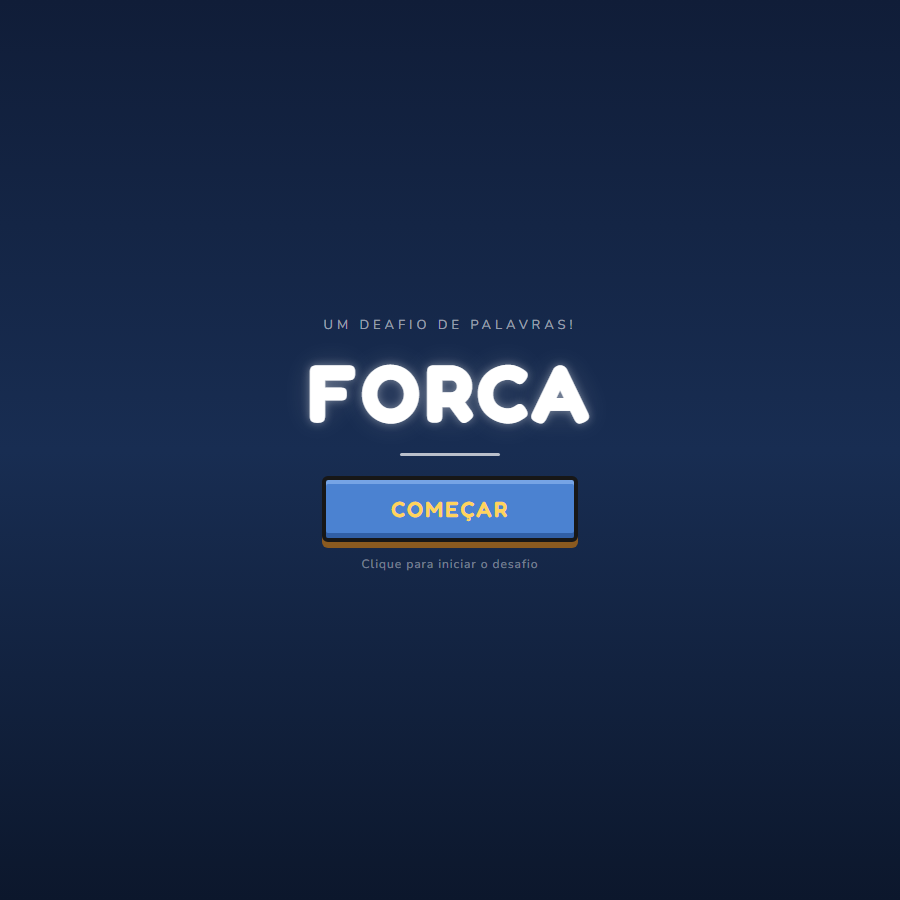
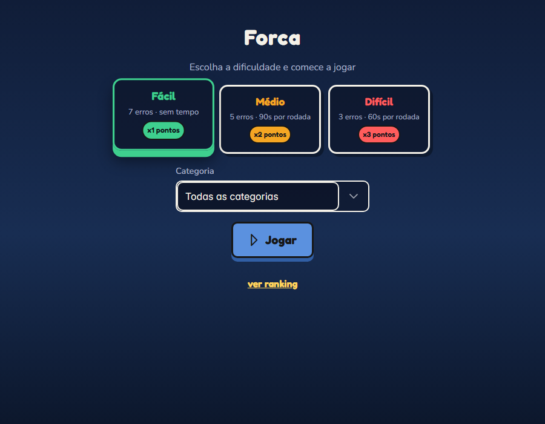
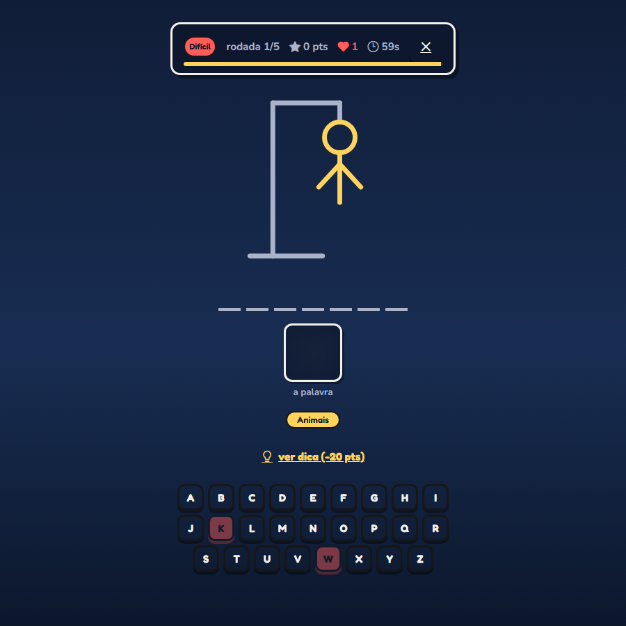

# Forca

Um jogo da forca com modos de dificuldade, sistema de pontuação, dicas, ranking salvo no navegador e um boneco que é desenhado traço a traço a cada erro — construído em React + Vite + PrimeReact.

**🔗 Jogar agora: [forca-zijk.onrender.com](https://forca-zijk.onrender.com)**

<p>
  <a href="#português">🇧🇷 Português</a> ·
  <a href="#english">🇺🇸 English</a>
</p>

<p align="center">
  
  
  
</p>

---

## Português

### O que é

"Forca" é o clássico jogo de adivinhar a palavra letra por letra — com um empurrão a mais: em vez de só desenhar um boneco genérico, a "imagem" da palavra (um emoji temático) vai ficando nítida conforme você acerta, e o boneco do cadafalso é desenhado ao vivo, traço a traço, a cada erro, sempre terminando exatamente no erro que perde a rodada, em qualquer dificuldade.

### Como jogar

1. Escolha a dificuldade (Fácil, Médio ou Difícil) e, opcionalmente, uma categoria de palavras.
2. Adivinhe a palavra clicando nas letras (ou digitando no teclado).
3. Erros demais desenham o boneco na forca; acertos revelam a imagem da palavra.
4. Cada partida tem 5 rodadas. No fim, salve seu nome no ranking.

### Funcionalidades

- **3 modos de dificuldade** — cada um muda o número de erros permitidos, se tem cronômetro, se a dica é automática ou custa pontos, e o multiplicador de pontuação (`src/sistemas/dificuldade.js`).
- **194 palavras** em 10 categorias (Animais, Comidas, Objetos, Natureza, Transporte, Esportes, Profissões, Lugares, Roupas, Tecnologia) — `src/dados/palavras.js`.
- **Sistema de pontuação** — pontos base, bônus por rodada sem erro, bônus de tempo restante, descontos por erro e por usar dica, tudo multiplicado pela dificuldade (`src/integracao/pontuacao.js`).
- **Boneco da forca animado** — SVG desenhado com `stroke-dashoffset`, escalado para terminar exatamente no erro que perde a rodada, seja no modo com 3, 5 ou 7 erros (`src/componentes/BonecoForca.jsx`).
- **Ranking persistente** — guardado no `localStorage` do navegador, sem precisar de servidor/banco de dados; ranking geral e por modo (`src/sistemas/ranking.js`).
- Sorteio de palavras sem repetição ("sacola de bingo") até esgotar o banco.

### Rodando localmente

Pré-requisito: [Node.js](https://nodejs.org).

```bash
npm install
npm run dev
```

Abre em `http://localhost:5173`.

```bash
npm run build    # gera a versão de produção em dist/
npm run preview  # serve o build de produção localmente
```

### Tecnologias

React 18 · Vite · [PrimeReact](https://primereact.org/) (Card, Button, DataTable, Dialog, Dropdown, ProgressBar, SelectButton) · localStorage

### Estrutura do projeto

```
src/
├─ componentes/     telas e peças de UI (TelaInicial, SelecaoModo, TelaJogo, TelaFim, Ranking, BonecoForca...)
├─ dados/           banco de palavras
├─ ganchos/         usarJogo — o hook que junta tudo
├─ integracao/      pontuacao.js — regra de pontos
├─ sistemas/        palavras, dificuldade, sorteio, ranking, armazenamento (localStorage)
└─ estilos.css      tema visual
```

---

## English

### What is this

"Forca" (Portuguese for "hangman") is the classic letter-guessing word game, with a twist: instead of a static drawing, the word's "image" (a themed emoji) sharpens as you guess correctly, and the gallows figure is drawn live, stroke by stroke, with each wrong guess — always finishing exactly on the guess that loses the round, no matter the difficulty.

**🔗 Play now: [forca-zijk.onrender.com](https://forca-zijk.onrender.com)**

### How to play

1. Pick a difficulty (Easy, Medium or Hard) and, optionally, a word category.
2. Guess the word by clicking letters (or typing on your keyboard).
3. Too many wrong guesses draw the hangman figure; correct guesses reveal the word's image.
4. Each match has 5 rounds. At the end, save your name to the leaderboard.

### Features

- **3 difficulty modes** — each changes allowed mistakes, whether there's a timer, whether the hint is free or costs points, and the score multiplier (`src/sistemas/dificuldade.js`).
- **194 words** across 10 categories (Animals, Food, Objects, Nature, Transport, Sports, Professions, Places, Clothing, Technology) — `src/dados/palavras.js`.
- **Scoring system** — base points, a flawless-round bonus, a time-left bonus, deductions for mistakes and for using a hint, all scaled by the difficulty multiplier (`src/integracao/pontuacao.js`).
- **Animated hangman figure** — an SVG drawn with `stroke-dashoffset`, scaled to always complete exactly on the mistake that loses the round, whether the mode allows 3, 5, or 7 mistakes (`src/componentes/BonecoForca.jsx`).
- **Persistent leaderboard** — stored in the browser's `localStorage`, no backend needed; overall and per-mode rankings (`src/sistemas/ranking.js`).
- No-repeat word draws ("bingo bag" shuffling) until the word bank is exhausted.

### Running locally

Requirement: [Node.js](https://nodejs.org).

```bash
npm install
npm run dev
```

Opens at `http://localhost:5173`.

```bash
npm run build    # production build into dist/
npm run preview  # serve the production build locally
```

### Tech stack

React 18 · Vite · [PrimeReact](https://primereact.org/) (Card, Button, DataTable, Dialog, Dropdown, ProgressBar, SelectButton) · localStorage

### Project structure

```
src/
├─ componentes/     screens and UI pieces (TelaInicial, SelecaoModo, TelaJogo, TelaFim, Ranking, BonecoForca...)
├─ dados/           word bank
├─ ganchos/         usarJogo — the hook that wires everything together
├─ integracao/      pontuacao.js — scoring rules
├─ sistemas/        words, difficulty, shuffling, ranking, storage (localStorage)
└─ estilos.css      visual theme
```
